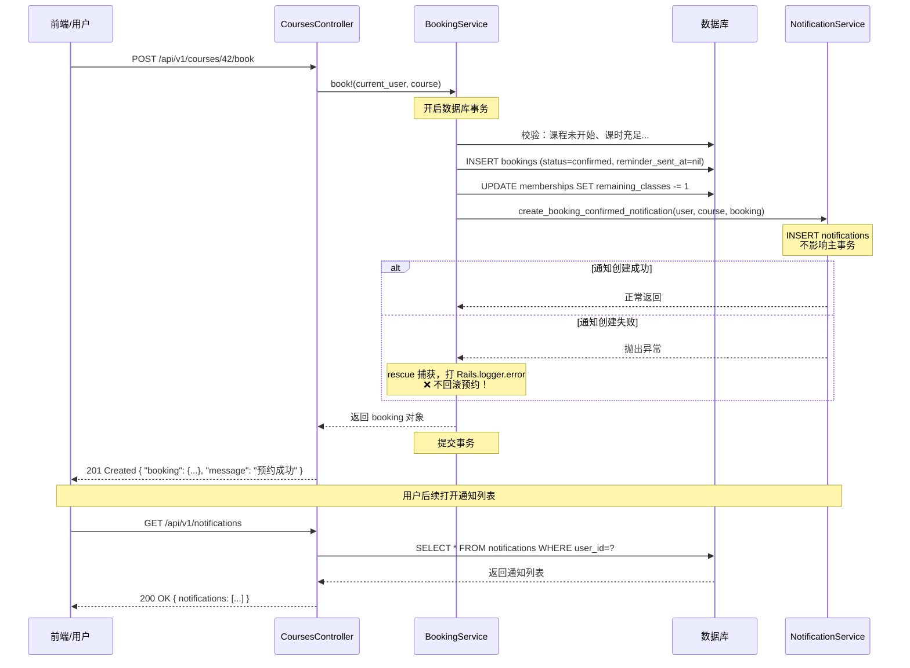
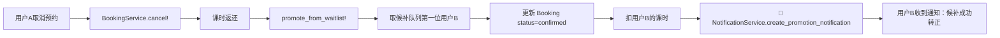

# 🧘 瑜伽工作室通知系统架构说明

Hi～欢迎接手通知模块！这份文档会帮你快速搞懂整个通知系统是怎么跑起来的。不用死记硬背，看完大概知道去哪儿找代码就行。

---

## 📋 一句话总结

用户在预约/取消课程时，BookingService 会调用 NotificationService 发站内通知；另外有个定时 rake 任务每天扫一遍即将开课的课程，给学员发课前提醒。所有通知通过 API 暴露给前端，用户可以看列表、标记已读。

---

## 🗄️ 一、数据模型设计

### Notification 表结构

| 字段 | 类型 | 说明 |
|------|------|------|
| `user_id` | bigint | 通知发给谁（必填） |
| `title` | string | 通知标题，比如"预约成功"（必填） |
| `body` | text | 通知正文，具体内容（必填） |
| `notifiable_type` | string | 多态关联类型，比如 "Booking" / "Course" |
| `notifiable_id` | bigint | 多态关联ID |
| `read_at` | datetime | 已读时间，nil = 未读 |
| `created_at` | datetime | 创建时间 |
| `updated_at` | datetime | 更新时间 |

代码见 [notification.rb](file:///d:/code/ai-prompt/solo-chrome-dev-F12/repos/repo76/project76/app/models/notification.rb)。

### 为什么用多态关联（polymorphic）而不是单独建表？

刚开始你可能会想：不如建 `booking_notifications`、`course_notifications` 两张表，每张表对应一种业务？

原因很简单：**通知本质上是同一种东西**。不管是预约成功还是课前提醒，它们都是"给用户发一条消息"，数据结构完全一样。

用多态的好处：

```ruby
# 关联 Booking
notification.notifiable = booking  # notifiable_type="Booking", notifiable_id=123

# 关联 Course
notification.notifiable = course   # notifiable_type="Course", notifiable_id=456
```

以后要加新通知类型（比如签到成功通知），**不需要改数据库**，直接传新的 notifiable 对象就行。如果是独立表，每次都得加迁移。

> 💡 小提示：多态关联在 `belongs_to` 上写 `polymorphic: true`，对应表需要 `_type` 和 `_id` 两个字段。

### 为什么 read_at 用时间戳而不是 boolean？

`read_at:datetime` vs `read:boolean`，看起来都能用，为什么选前者？

- **知道具体什么时候读的**：以后做数据分析（用户多久会看通知）或者用户投诉"我明明没看"，有时间戳就能查
- **向后兼容**：万一以后要加"30天前已读的通知归档"这种需求，直接按时间筛选就行
- **表达能力更强**：`nil` = 未读，有值 = 已读，跟 boolean 一样好用，但信息更多

代码里判断已读未读很简单：

```ruby
notification.unread?  # read_at.nil?
notification.read?    # read_at.present?
notification.mark_as_read!  # update!(read_at: Time.now)
```

---

## 🔧 二、NotificationService：所有通知的"工厂"

通知逻辑全部封装在 [notification_service.rb](file:///d:/code/ai-prompt/solo-chrome-dev-F12/repos/repo76/project76/app/services/notification_service.rb) 里。

### 设计理念

> BookingService 别管通知内容长什么样，只要告诉我"发生了什么事"，我来生成对应的通知。

这样做的好处：**加新通知类型只改 NotificationService，BookingService 完全不用动**。

### 方法一览（5种通知场景）

| 方法 | 触发时机 | 标题示例 |
|------|----------|----------|
| `create_booking_confirmed_notification(user, course, booking)` | 预约成功 | 预约成功 |
| `create_waitlist_notification(user, course, waitlist)` | 进入候补 | 已进入候补名单 |
| `create_cancellation_notification(user, course, booking)` | 取消预约/取消候补 | 预约已取消 / 候补已取消 |
| `create_promotion_notification(user, course, booking)` | 候补转正 | 候补成功转正 |
| `create_reminder_notification(user, course)` | 开课前2小时提醒 | 课程即将开始 |

还有个辅助方法：

| 方法 | 用途 |
|------|------|
| `reminder_already_sent?(user, course)` | 判断某用户某课程是否已发过提醒（主要用于旧逻辑兼容） |

### 加一种新通知的步骤（超简单）

比如要加"签到成功"通知：

1. 在 `NotificationService` 里加个方法：
```ruby
def self.create_checkin_notification(user, course, attendance)
  Notification.create!(
    user: user,
    title: '签到成功',
    body: "您已成功签到「#{course.name}」课程，好好享受练习~",
    notifiable: attendance
  )
end
```

2. 在老师签到的地方（比如 `AttendancesController`）调用一下：
```ruby
begin
  NotificationService.create_checkin_notification(user, course, attendance)
rescue StandardError => e
  Rails.logger.error "..."
end
```

搞定！不需要改数据库、不需要改模型、不需要改其他服务。

---

## 🤝 三、BookingService ↔ NotificationService 的协作

这是整个通知系统最容易踩坑的地方，**一定要理解事务边界**。

### 协作流程

```
用户点击预约
    ↓
BookingService.book! 开始数据库事务
    ↓
├─ 校验预约资格（课程未满、课时充足...）
├─ 创建 Booking 记录
├─ 扣减课时
└─ 📢 调用 NotificationService 发通知（用 rescue 包起来！）
    ↓
事务提交
```

代码见 [booking_service.rb](file:///d:/code/ai-prompt/solo-chrome-dev-F12/repos/repo76/project76/app/services/booking_service.rb)。

### 为什么通知创建失败不能回滚主流程？

**因为通知是次要功能。**

想象一下：用户预约成功了，课时也扣了，结果因为数据库某个索引出问题导致通知创建失败。这时候如果整个事务回滚——预约没了、课时也没扣——用户会想"我明明点了预约怎么没了？"，反而会造成更大的困惑。

正确的做法是：

```ruby
begin
  NotificationService.create_booking_confirmed_notification(@user, @course, booking)
rescue StandardError => e
  Rails.logger.error "Failed to send booking confirmed notification for user #{@user.id}: #{e.message}"
end
```

- 通知创建成功 → 皆大欢喜
- 通知创建失败 → 打个日志，主流程继续，预约不回滚

> ⚠️ **重要原则**：任何调用 NotificationService 的地方，都要用 `begin/rescue` 包起来。别让通知的失败影响了业务主流程。

---

## ⏰ 四、定时提醒任务（rake + cron）

### rake 任务逻辑

文件在 [reminders.rake](file:///d:/code/ai-prompt/solo-chrome-dev-F12/repos/repo76/project76/lib/tasks/reminders.rake)。

执行流程：

```
rake reminders:send_class_reminders
    ↓
扫描 start_time 在 [2小时后, 1小时后] 之间的课程
    ↓
每门课遍历所有 confirmed 的 booking
    ↓
只处理 reminder_sent_at 为 nil 的（去重机制）
    ↓
发通知 + 把 reminder_sent_at 设为当前时间
```

### 去重为什么用 Booking.reminder_sent_at 而不是查 Notification 表？

之前踩过坑：最早是查 `user.notifications.where(title: '课程即将开始', notifiable: course)` 来去重，但这样有问题：
- 如果 Notification 表被清理过（比如删了3个月前的通知），就会重复发
- 每次判断都要多查一次数据库，性能差
- Notification 和 Booking 是两张表，可能数据不一致

所以在 **Booking 表** 上加了 `reminder_sent_at:datetime` 字段：
- `nil` = 还没发过提醒
- 有时间戳 = 已经发过了，跳过

谁预约、谁收提醒，状态存在预约记录上，**单一数据源，绝对不会错**。

### cron / Sidekiq 配置建议

**最简单（推荐生产用）：系统 cron**

```bash
# 每小时执行一次，比如每小时的第5分钟跑
5 * * * * cd /path/to/project && /usr/local/bin/bundle exec rake reminders:send_class_reminders >> log/reminders.log 2>&1
```

为什么每小时跑一次？因为扫描窗口是"未来1-2小时内开课"，每小时跑一次足够覆盖，错过的概率极低。就算某小时任务挂了，下一小时还能补。

**如果已经在用 Sidekiq**：

```ruby
# app/workers/reminder_worker.rb
class ReminderWorker
  include Sidekiq::Worker

  def perform
    Rake::Task['reminders:send_class_reminders'].reenable
    Rake::Task['reminders:send_class_reminders'].invoke
  end
end

# config/initializers/sidekiq.rb 或 sidekiq.yml
# 每小时执行一次
Sidekiq::Cron::Job.create(name: 'class-reminders', cron: '5 * * * *', class: 'ReminderWorker')
```

---

## 📡 五、API 接口说明

通知相关的控制器在 [notifications_controller.rb](file:///d:/code/ai-prompt/solo-chrome-dev-F12/repos/repo76/project76/app/controllers/api/v1/notifications_controller.rb)。

### 1. 获取通知列表

```
GET /api/v1/notifications
```

**Query 参数**：

| 参数 | 类型 | 说明 |
|------|------|------|
| `read` | string | `true` = 只看已读，`false` = 只看未读，不传 = 全部 |
| `page` | integer | 页码，默认 1 |
| `per_page` | integer | 每页条数，默认 20 |

**返回示例**：

```json
{
  "notifications": [
    {
      "id": 1,
      "title": "预约成功",
      "body": "您已成功预约「晨间哈他瑜伽」课程，上课时间：06月27日 07:00。",
      "notifiable_type": "Booking",
      "notifiable_id": 42,
      "read_at": null,
      "created_at": "2026-06-26T10:30:00.000Z",
      "unread": true
    }
  ],
  "meta": {
    "current_page": 1,
    "total_pages": 2,
    "total_count": 25,
    "per_page": 20
  }
}
```

### 2. 标记单条通知为已读

```
PATCH /api/v1/notifications/:id/read
```

**返回示例**：

```json
{
  "message": "Notification marked as read",
  "notification": {
    "id": 1,
    "title": "预约成功",
    "unread": false,
    "read_at": "2026-06-26T11:00:00.000Z"
  }
}
```

### 3. UserSerializer 里的 unread_count

每次获取用户信息时会返回一个 `unread_count` 字段，前端导航栏小红点就靠它：

```json
{
  "user": {
    "id": 1,
    "name": "李晓明",
    "unread_count": 3   // ← 有3条未读，显示小红点
  }
}
```

**前端使用建议**：
- 页面初始化时拉一次 `/api/v1/auth/login` 或用户接口，拿 `unread_count` 显示红点
- 打开通知列表页后，调用 `/api/v1/notifications?read=false` 看未读
- 用户点进某条通知详情，调 `PATCH /api/v1/notifications/:id/read` 标记已读，然后 `unread_count - 1`
- 如果嫌手动维护麻烦，每 30 秒轮询一次用户接口刷新 `unread_count` 也行（反正数据量小）

---

## 🔄 六、完整链路流程图

下面以"用户预约课程"为例，展示从请求到通知的完整链路：



再看"候补转正"这种被动通知的场景（不是用户主动触发的）：



---

## 📁 七、相关文件索引

找不到代码的时候看这里：

| 类型 | 路径 |
|------|------|
| 模型 | [app/models/notification.rb](file:///d:/code/ai-prompt/solo-chrome-dev-F12/repos/repo76/project76/app/models/notification.rb) |
| 模型 | [app/models/user.rb](file:///d:/code/ai-prompt/solo-chrome-dev-F12/repos/repo76/project76/app/models/user.rb#L10) (has_many :notifications) |
| 服务 | [app/services/notification_service.rb](file:///d:/code/ai-prompt/solo-chrome-dev-F12/repos/repo76/project76/app/services/notification_service.rb) |
| 服务 | [app/services/booking_service.rb](file:///d:/code/ai-prompt/solo-chrome-dev-F12/repos/repo76/project76/app/services/booking_service.rb) |
| 控制器 | [app/controllers/api/v1/notifications_controller.rb](file:///d:/code/ai-prompt/solo-chrome-dev-F12/repos/repo76/project76/app/controllers/api/v1/notifications_controller.rb) |
| 路由 | [config/routes.rb](file:///d:/code/ai-prompt/solo-chrome-dev-F12/repos/repo76/project76/config/routes.rb#L14) |
| 序列化器 | [app/serializers/notification_serializer.rb](file:///d:/code/ai-prompt/solo-chrome-dev-F12/repos/repo76/project76/app/serializers/notification_serializer.rb) |
| 序列化器 | [app/serializers/user_serializer.rb](file:///d:/code/ai-prompt/solo-chrome-dev-F12/repos/repo76/project76/app/serializers/user_serializer.rb#L2) (unread_count) |
| rake 任务 | [lib/tasks/reminders.rake](file:///d:/code/ai-prompt/solo-chrome-dev-F12/repos/repo76/project76/lib/tasks/reminders.rake) |
| 数据库迁移 | [db/migrate/20240101000007_create_notifications.rb](file:///d:/code/ai-prompt/solo-chrome-dev-F12/repos/repo76/project76/db/migrate/20240101000007_create_notifications.rb) |
| 数据库迁移 | [db/migrate/20240101000008_add_reminder_sent_at_to_bookings.rb](file:///d:/code/ai-prompt/solo-chrome-dev-F12/repos/repo76/project76/db/migrate/20240101000008_add_reminder_sent_at_to_bookings.rb) |
| 测试 | [spec/services/notification_service_spec.rb](file:///d:/code/ai-prompt/solo-chrome-dev-F12/repos/repo76/project76/spec/services/notification_service_spec.rb) |
| 测试 | [spec/tasks/reminders_spec.rb](file:///d:/code/ai-prompt/solo-chrome-dev-F12/repos/repo76/project76/spec/tasks/reminders_spec.rb) |

---

## ✅ 八、测试覆盖情况

运行测试：

```bash
# 测 NotificationService 各方法是否正确生成通知
bundle exec rspec spec/services/notification_service_spec.rb

# 测提醒任务的去重、重试逻辑
bundle exec rspec spec/tasks/reminders_spec.rb

# 全部跑
bundle exec rspec
```

### 已覆盖的场景

**NotificationService（6个场景）**：
- ✅ 预约成功通知的字段正确性
- ✅ 候补通知的字段和排位信息
- ✅ 取消预约通知的内容（区分取消预约和取消候补）
- ✅ 候补转正通知的内容
- ✅ 课前提醒（含 location 为空的 fallback）
- ✅ 去重检查方法（已发/未发/其他通知干扰）

**Reminder Rake（5个场景）**：
- ✅ 重复执行 rake 任务不会发重复通知
- ✅ 同一课程多名会员预约，所有人都收到
- ✅ 取消后重新预约的会员能正常收到
- ✅ 收到提醒后才取消，reminder_sent_at 不清空
- ✅ 只有 confirmed 状态的 booking 收提醒

---

## 🚧 九、已知限制与未来可拓展方向

目前的通知系统是**站内通知**（存在数据库里，前端拉取展示），是最基础的版本。以下功能目前**没有做**，如果你要接手迭代可以参考：

| 功能 | 现状 | 可以怎么加 |
|------|------|------------|
| **邮件推送** | ❌ 无 | 新增 `NotificationMailer`，在 `NotificationService` 创建通知后顺便 `deliver_later` |
| **短信推送** | ❌ 无 | 接阿里云/腾讯云 SMS SDK，同上，异步发送 |
| **实时推送（WebSocket）** | ❌ 无，前端靠轮询 | 加 ActionCable，用户登录后订阅 `notifications_channel`，创建通知时 `broadcast` 过去 |
| **批量标记已读** | ❌ 只能单条标记 | 加个 `POST /api/v1/notifications/read_all` 接口，一句 `current_user.notifications.unread.update_all(read_at: Time.now)` 搞定 |
| **删除通知** | ❌ 不支持删除 | 加个 destroy 接口就行，记得 `dependent: :destroy` 已经配好了 |
| **通知模板配置** | ❌ 文案写死在代码里 | 把 title/body 抽到 i18n（config/locales/notifications.zh-CN.yml），方便运营改文案 |
| **后台管理通知** | ❌ 管理员无法发全站公告 | 加个 `Admin::NotificationsController`，支持给所有用户或指定用户发系统通知 |

---

## 💡 十、新人修改 Checklist

改通知相关代码之前，先过一遍这个清单：

- [ ] 我要加新通知类型？→ 在 `NotificationService` 加方法，**不要**直接在业务代码里 `Notification.create!`
- [ ] 调用 NotificationService 的地方？→ 一定要用 `begin/rescue StandardError` 包起来，**别让通知失败影响主流程**
- [ ] 改 rake 提醒任务？→ 测试时多跑两遍，确认不会重复发通知
- [ ] 改了 Booking 表字段？→ 别忘了同步改 `db/schema.rb` 和相关 factory
- [ ] 新增了接口？→ 在本文档第五节更新 API 列表

Good luck！有问题直接翻代码，代码比文档更新 😄
